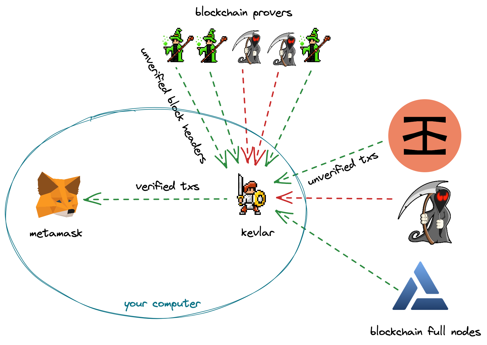

# Kevlar

## An Ethereum State Sharding Solution

Kevlar is a state sharding solution which allows for a large number of shards to exist simultaneously, each maintaining its own state and processing its own transactions. It's a CLI tool that runs a light client-based RPC proxy for PoS Ethereum. It can be used to make your Metamask or any RPC-based wallet completely trustless!

When Kevlar is started, it first syncs to the latest header of the beacon chain, which is the central chain that coordinates the shards of the Ethereum 2.0 network. Then, it starts an RPC server. This local RPC server can be added to MetaMask or any other RPC-based wallet. Every RPC call made by the wallet is then verified using Merkle Inclusion proofs to the latest block header. This way, it ensures that all the data that the wallet is requesting is valid and that it hasn't been tampered with.

Kevlar supports two kinds of sync methods: the **Light Sync** and the **Optimistic Sync**. Light sync is based on the light client sync protocol specified by the Ethereum Specification, while the Optimistic Sync is based on a construction from the research paper Proofs of [Proofs of Proof of Stake in Sublinear Complexity](https://arxiv.org/abs/2209.08673). The Optimistic sync is considered to be 100x faster than the Light sync.

In summary, Kevlar aims to improve trustlessness and security of light client by providing a local RPC proxy that validates all requests to the Ethereum network using Merkle proofs. It is built on top of the Ethereum 2.0 beacon chain and it can sync to the network in a fast and efficient way.

[](https://discord.gg/ePV3prSPGW)


### Start the RPC Proxy

```bash
npm i -g @lightclients/kevlar
kevlar
```

The PRC is now available at `http://localhost:8546`. Add this local network to metamask.

```bash
kevlar --help
Options:
      --help        Show help                                          [boolean]
      --version     Show version number                                [boolean]
  -n, --network     chain id to start the proxy on (1, 5)        [choices: 1, 5]
  -c, --client      type of the client          [choices: "light", "optimistic"]
  -o, --provers     comma separated prover urls
  -u, --rpc         rpc url to proxy
  -p, --port        port to start the proxy                             [number]
  -a, --beacon-api  beacon chain api URL
```

### Build Locally

Clone the repo and perform the following commands

```bash
yarn install
yarn build
```

### Run Server

```bash
cp .env.example .env
yarn start
```

### Deploy Server to heroku

```bash
bash src/provers/light-optimistic/deploy-heroku.sh <heroku-app-name>
```

### Deploy to Docker

```bash
docker run -p 8546:8546 --name kevlar shresthagrawal/kevlar
curl -X POST --header "Content-type: application/json" --data '{"jsonrpc":"2.0","method":"eth_blockNumber","params":[],"id":1}' http://localhost:8546/
```
